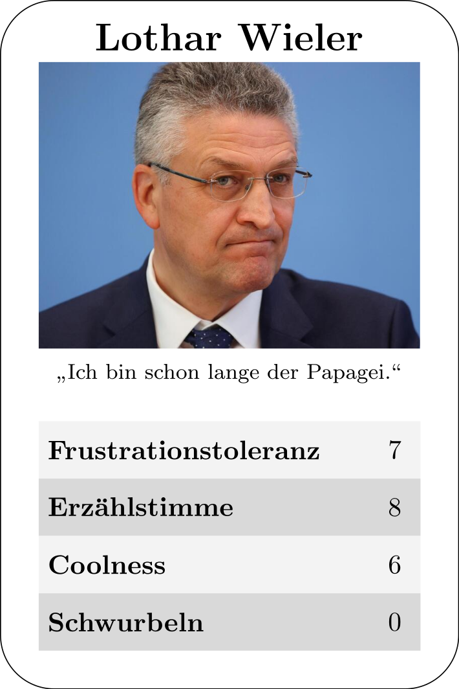

# Erzeuge dein eigenes Quartettspiel rund um die SARS-CoV-2-Pandemie

So sieht ein Beispiel aus:

Pull-Requests mit neuen Karten für das [Deck](https://github.com/hollma/coronaquartett/tree/main/deck) sind gern gesehen.
